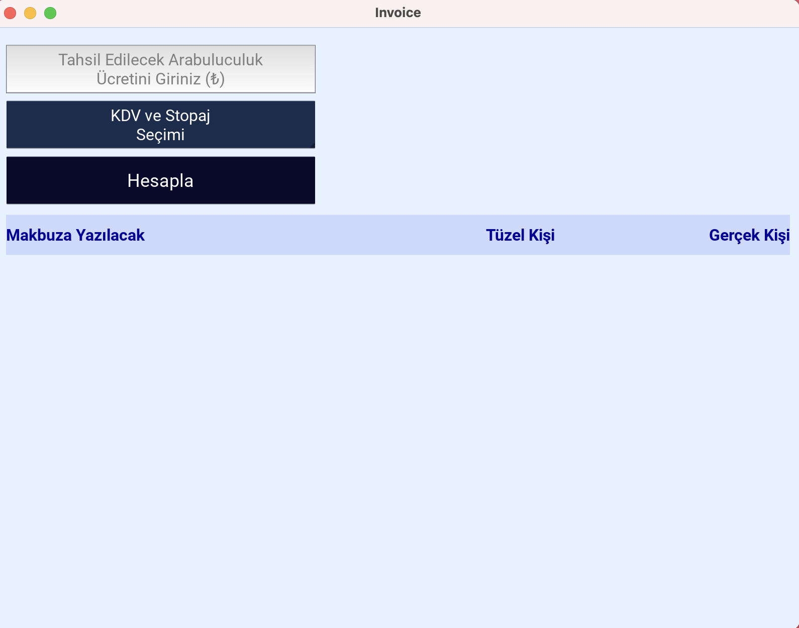
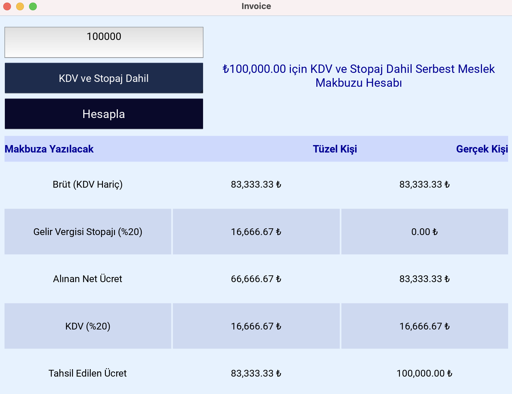

# invoCal - Mediation Invoice Calculator

## English

### Overview
This module helps in calculating mediation fees based on different parameters such as VAT (KDV) and withholding tax (Stopaj).

### Features
- Supports different tax options
- Provides detailed invoice calculations
- User-friendly interface

### Usage
1. Enter the mediation fee.
2. Select the tax option.
3. View the calculated amounts for individuals and corporations.

---

## Türkçe

### Genel Bakış
Bu modül, KDV ve Stopaj gibi farklı parametrelere dayalı olarak arabuluculuk ücretlerini hesaplamaya yardımcı olur.

### Özellikler
- Farklı vergi seçeneklerini destekler
- Detaylı fatura hesaplamaları sağlar
- Kullanıcı dostu arayüz

### Kullanım
1. Arabuluculuk ücretini girin.
2. Vergi seçeneğini belirleyin.
3. Gerçek ve tüzel kişiler için hesaplanan miktarları görüntüleyin.

## Screenshots

### Old Invoice Screen 01

### Old Invoice Screen 02

