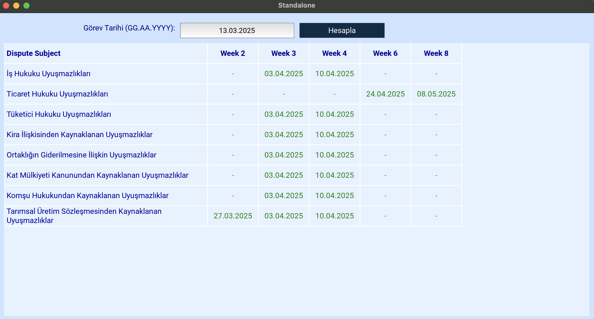

# Arabuluculuk Süre Hesaplama

Arabuluculuk Süre Hesaplama (MedTime), farklı hukuki uyuşmazlık türleri için arabuluculuk sürelerini hesaplamaya yardımcı olan bir Python uygulamasıdır. Bu program, başlangıç tarihine göre çeşitli uyuşmazlık türleri için son tarihleri otomatik olarak hesaplar.

## Ekran Görüntüsü



## Özellikler

- Çeşitli hukuki uyuşmazlık türleri için süre hesaplamaları
- Kullanıcı dostu grafiksel arayüz
- Bağımsız uygulama olarak veya başka bir uygulamaya gömülü olarak çalışabilme
- Tarih tabanlı hesaplamalar

## Desteklenen Uyuşmazlık Türleri

- İş Hukuku Uyuşmazlıkları
- Ticaret Hukuku Uyuşmazlıkları
- Tüketici Hukuku Uyuşmazlıkları
- Kira İlişkisinden Kaynaklanan Uyuşmazlıklar
- Ortaklığın Giderilmesine İlişkin Uyuşmazlıklar
- Kat Mülkiyeti Kanunundan Kaynaklanan Uyuşmazlıklar
- Komşu Hukukundan Kaynaklanan Uyuşmazlıklar
- Tarımsal Üretim Sözleşmesinden Kaynaklanan Uyuşmazlıklar

## Kurulum

1. Python 3.x'i [Python'un resmi sitesinden](https://www.python.org/downloads/) indirin ve kurun.
2. Bu repository'yi klonlayın veya indirin.
3. Gerekli olan tek bağımlılık tkinter'dır, bu genellikle Python ile birlikte gelir.

## Kullanım

### Bağımsız Mod

Uygulamayı bağımsız bir program olarak çalıştırmak için:

```bash
python demo.py
```

### Gömülü Mod

Uygulamayı başka bir uygulamanın içine gömmek için:

```bash
python demo.py --embedded
```

## Programın Yapısı

- `__init__.py`: Modül tanımlaması ve dışa aktarma işlemleri.
- `calculator.py`: Süre hesaplama mantığını içeren ana sınıf.
- `gui.py`: Tkinter tabanlı kullanıcı arayüzü bileşenleri.
- `demo.py`: Uygulamanın kullanımını gösteren örnek kod.

## Nasıl Çalışır

1. Kullanıcı, arayüzdeki tarih giriş alanına başlangıç tarihini "GG.AA.YYYY" formatında girer.
2. "Hesapla" düğmesine tıklandığında, her uyuşmazlık türü için farklı hafta aralıklarına göre son tarihler hesaplanır.
3. Hesaplanan tarihler, tabloda her bir uyuşmazlık türü ve hafta değeri için gösterilir.

## Katkıda Bulunma

1. Bu repository'yi forklayın
2. Kendi feature branch'inizi oluşturun (`git checkout -b feature/AmazingFeature`)
3. Değişikliklerinizi commit edin (`git commit -m 'Add some AmazingFeature'`)
4. Branch'inizi push edin (`git push origin feature/AmazingFeature`)
5. Pull Request oluşturun

## Lisans

[***]

## İletişim

info@ozco.studio

---

Arabuluculuk Süre Hesaplama - Hukuki arabuluculuk süreçlerinde zaman planlaması için yardımcı araç.